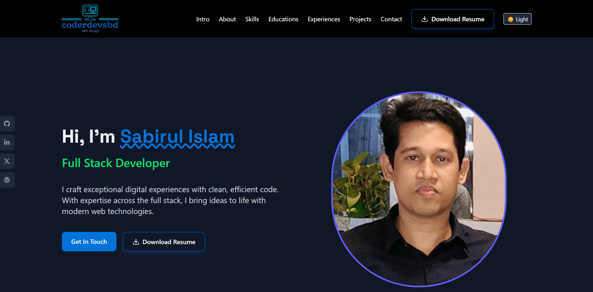

<!-- Cover Image -->

<h1 align="center">👋 Hi, I'm Sabir – Front-End Developer</h1>

  <a href="https://sabir-portfolio-2a4b1.web.app/">🌐 Visit My Portfolio</a> •
  <a href="#-about-me">👨‍💻 About</a> •
  <a href="#-tech-stack">🛠 Tech Stack</a> •
  <a href="#-features">✨ Features</a> •
  <a href="#-contact">📬 Contact</a>

---

## 👨‍💻 About Me

I'm a passionate and detail-oriented Front-End Developer who loves crafting beautiful and responsive web interfaces. I take pride in writing clean, efficient, and scalable code. I enjoy turning complex problems into elegant user-friendly solutions.

- 🌱 Currently exploring **React Ecosystem & UI/UX best practices**
- 🛠 Focused on building **responsive**, **accessible**, and **performant** web apps
- ⚡ Fun fact: I love to learn through building and breaking things!

---

## 🛠 Tech Stack

  
  
  
  
  
  
  

---

## ✨ Features

Here’s what you’ll find on my portfolio:

- 🎯 **Intro Section**: Personal summary and professional role
- 🧰 **Skills Grid**: Technologies I use with icons
- 🧑‍💻 **Project Showcase**: Real-world projects with links and descriptions
- 🌐 **Responsive Design**: Optimized for all devices
- 📩 **Contact Form**: Easy way to reach me directly

---

## 🚀 How to View the Portfolio

The site is live and hosted using **Firebase Hosting**.

👉 [Click here to visit my portfolio](https://sabir-portfolio-2a4b1.web.app/)

---

## 📬 Contact

Got a project in mind or just want to say hi? Let's connect!

  
  
  

---

## 📝 License

This project is licensed for personal portfolio purposes. Feel free to take inspiration but kindly give credit!

---

> Designed & developed with ❤️ by Sabir